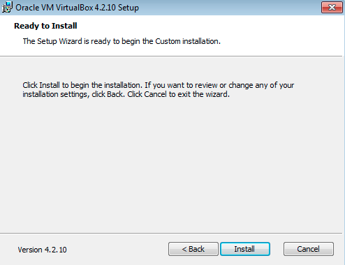

.. SuPyJogo documentation master file, created by
   sphinx-quickstart on Sun Dec 17 16:36:23 2017.
   You can adapt this file completely to your liking, but it should at least
   contain the root `toctree` directive.

**INSTALAÇÃO DE PROGRAMAS**
===========================

INSTALAR ORACLE VM VIRTUALBOX
-----------------------------

O VirtualBox é um sistema que possibilita criar e gerenciar maquinas virtuais no seu computador. O que isso significa? Significa que é possível rodar outro sistema operacinoal no seu computador sem desinstalar o atual. Pode-se rodar o Linux dentro do Windows, o Windows dentro do Mac e o Mac dentro do Windows, etc.

**Passo a Passo**

Baixe o programa no site da Oracle.

.. image:: _static/virtualbox1.png

Clique no ícone do Virtualox na sua pasta de downloads.

.. image:: _static/vbox2.png

Abrirá uma aba que indica o início do seu processo de instalação.
Clique em NEXT.

A próxima aba indica o local em que o programa será salvo em seu computador. Mantenha as informações selecionadas ou mude a seu gosto e clique em NEXT.

A aba abaixo indica se você quer um atalho para o seu Desktop ( primeiro quadrado selecionado) e para sua barra de ferramentas ( segundo quadrado selecionado). Faça suas escolhas e clique em NEXT.

Essa é uma aba de atenção. Indica que para prosseguir com a instalção você será disconectado da internet. Salve o que for preciso e clique em NEXT.

Finalmente, estamos prontos para iniciar o real processo de instalção. Clique em NEXT.

Sua intalção está completa. Clique em FINISH.

INSTALAR UBUNTU
---------------

Oracle VM VirtualBox Gerenciador

Novo
Nome:IntroComp
Tipo:Linux
Versão:Ubuntu (64-bit)

Tamanho da Memória:
2048

cirar um  novo
vdi
dinamicamente alocado

Localização e tamanho do arquivo
15,12

Armazenamento
Vazio
Ide secundário Master
Live CD/DVD

Adicionar cd
ubuntu

Iniciar seta verde

Esperar
Remover janela pop up
instalar ubuntu
instal updates
Reinstal ubuntu (continue)

Rio de Janeiro

Who are you
Your name:

Your computer’s name:

Pick a username:

Choose a password:

Confirm your password:

require password

INSTALAR UMAKER
---------------
Instalador profissional de ferramentas de programador - idepycharm

Terminal abre: Ctr /Sift/t

Escreva o nome do programa: umake
Descobre se tem ou n

sudo( significa que vc é administrador e manda)
apt (pacotes do ubuntu)
install
rm (remover)
seta para cima ou baixo repete linhas

sudo apt install umaker
sudo rm /(o que é necessário resolver, começando pela barra)
repete sudo apt install umaker
sudo rm /(o que é necessário resolver, começando pela barra)

sudo apt install ubuntu-make
umake ide pycharm

sudo apt install git

Concluiu a instalação desligar janela de execução e iniciar seta verde.

INSTALAR PYCHARM
----------------

**CRIAR CONTAS**
================

CONTA PROJETO PYCHARM
---------------------

Início de projeto:
file
settings
project
interpreter
configuração
create virtual environment
Python3.5
Marcar: Inherit global site-packages
Name:
Marcar (No)
Name:SuPyJogo
OK

CONTA NO GITHUB
---------------

Username:

email:

password:

continue
continue

participar do SuPyPerson
Inca

CONTA SLACK
-----------

O que estamos fazendo:
Formando um time profissional de desenvolvimento. Não usa windows pq tem muito virus. Ubunto profissional

CONTA WAFFLE.IO
---------------

**INTEGRAR CONTAS**
===================

**DOCUMENTOS DE LEITURA**
=========================

SPHINX CHEATSHEET
-----------------

**MODELAGEM ÁGIL**
==================

USER STORIES
------------

CRC CARDS
---------
